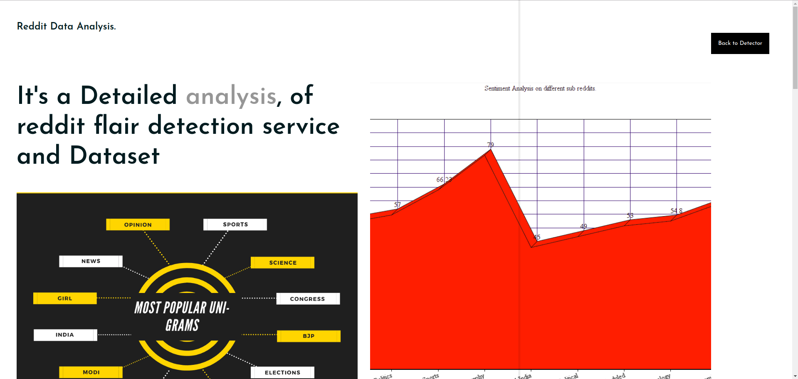
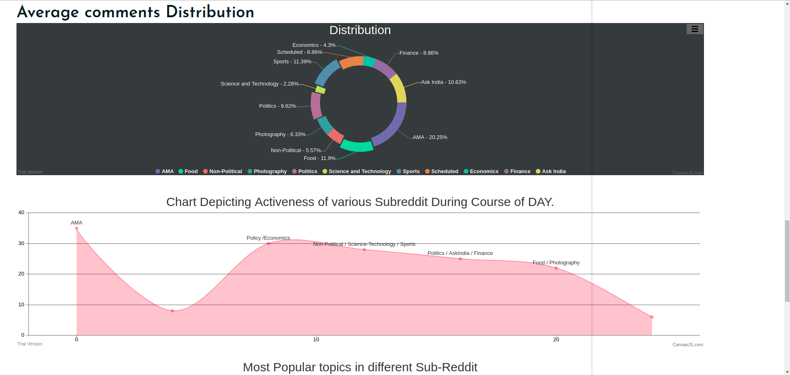

# GET THAT FLAIR, A supereasy to use Reddit-Flair Predictor.

Hi, I am Ujjwal Btech-CSE second year undergrad @ IIIT Delhi

It is a simple Web app I which you have to enter link of a sub-reddit post and you will be prediced flair of that subreddit post based on the model configured with web app.This project is deveoped for Precog @ IIIT Delhi

# How it works

Very easy to use, this web app is being hosted at heroku free Dynos. All you need to do is click on the link mentioned in the description and follow these very simple steps :

Index Page:

As soon as you click that link, you will be shown a a beautiful page with a animated reddit circle on it like this.

Then you are required to click that circle to move to the next page.

MAIN PAGE:

Now you can see a page requesting you to enter the link of your reedit post to get prediction of your FLAIR.

After that SURPRISE, you are again on the page with animated reddit circle.

Now click on the reddit symbol and VOILA!! there are your results.

This is so easy to use.

# BROWNIE YUMM!

As described in doc, I have conducted various data Analysis on the reddit dataset and add a page for it in my website.

Visit that page by clicking on the STATISTICS page as shown below.

# DATA ANALYSIS PAGE:

Now, if everything goes right, you will be at the DATA ANALYSIS Page.

I have done a lots of thing to visualise, understand data patterns. Some of the major things are listed below.

* Text Analysis
* Sentiment Analysis
* Forms BAG of WORDS
* Bi-Grams, TRI-Grams
* Word CHARTS representation in unique way
* Analysis of growth of r/india subreddit
* Average comments
* Topic Modeling

These all things are presented in a very beautiful way at DATA ANALYSIS PAGE.

# Techological Stack

1. Python is the core technology that supports the framework of this web app. This app uses DJANGO framework. All other codes for extracting data, training, testing is being done using PYTHON>

2. Cascading style sheets (CSS) and java script is also used to create the Front end of the web app to make it a little bit stylish and good looking.

# Accuracy

My application uses features like TITLE, URL and COMMENTS of the DATABASE and produces around 75.41 in SVM model and 76.19 in Random Forest. 

# Dependency

All dependencies are present in requirements.txt

# Clone it in your PC

Follow these Steps :

* Clone this repo
* Create Virtual Environment
* Then run commend $pip install -r requirements.txt
* After that run the server by command - $python3 manage.py runserver.

# Gratitute

I would like to thank team Precog @ IIIT Delhi for giving me the opportunity to work on this wonderful project.

# REFERENCES

https://towardsdatascience.com/scraping-reddit-data-1c0af3040768

https://machinelearningmastery.com/save-load-machine-learning-models-python-scikit-learn/

Google

W3 School

Stackoverflow
